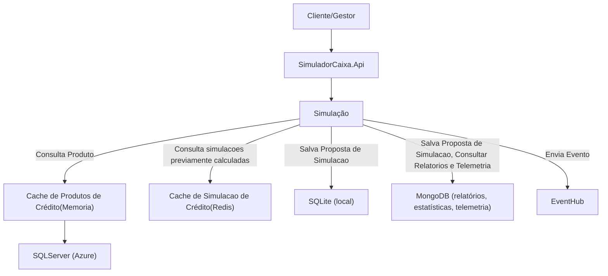

## Pré-requisitos

- [.NET 8+](https://dotnet.microsoft.com/download)
- [.NET Aspire](https://learn.microsoft.com/en-us/dotnet/aspire/get-started/aspire-overview)
- [Docker](https://www.docker.com/)

# SimuladorCaixa (.NET Aspire)

Este projeto é um simulador de caixa desenvolvido com .NET Aspire, utilizando arquitetura modular e integração automática com MongoDB. O AppHost já está configurado para iniciar todos os serviços necessários em ambiente local de desenvolvimento e realizar a configuração do banco de dados ao inicializar a aplicação.

## Esquema de Arquitetura




## Tomadas de decisões e Escolhas

-`SQLite`: Para atender um dos requisitos era um endpoint que retornasse as simulações por consulta paginada, optei bom um banco relacional local para realizar as persistências de forma não-normalizada. As simulacoes/parcelas salvei em formato JSON em uma coluna de texto. Não optei por utilizar o MongoDB para isso pois ele tem dificuldades com consultas paginadas. Há outras maneiras de paginar no MongoDB, mas mudaria a estrutura e não atenderia a necessidade;

-`MongoDB`: Inicialmente pensei em utilizar o Kusto (Data Explorer) para consumir os eventos do EventHUb e gerar os relatórios para os endpoints em que pedem estatisticas das simulações, entretanto, me deparei que emulador do Kusto não tem a opção de data streaming, teria que ter um processo de ingestão via script ou manual, o que aumentaria a complexidade do projeto para quem fosse avaliar. Situação similar ocorreu ao tentar optar por algum SDK para Telemetria. 

Assim, optei em utilizar o MongoDB onde criei duas coleções: propostas e telemetria. Então, quando acionamos os endpoints de volume por produto ou de sinteses de telemetria, as consultas rodam no próprio MongoDB e a aplicação apenas consome e não processa esses dados.

-`Redis`: Estou utilizando o Redis para cachear simulacoes ja realizadas, utilizo como chave a taxa de juros, valor e prazo. Entretanto, é um ponto para ser avaliado, meu intuito foi mostrar mais conhecimento da ferramenta em si.

-`Desenvolvimento`: Optei em utilizar clean architeture devido ao tamanho inicial de incertezas no inicio do projeto, como o de quais tecnologias utilizar. Assim, como o código já estava devidamente desacoplado, iniciei o projeto desenvolvendo a parte core e conforme as decisões de Infra iam ocorrendo, apenas modificava a parte de Infra do projeto. Um ponto que me ajudou bastante foi utilizar o padrão repository também.

## Estrutura do Projeto

- `src/SimuladorCaixa.AppHost`: Ponto de entrada da aplicação (.NET Aspire), já configurado para iniciar todos os serviços e o MongoDB.
- `src/SimuladorCaixa.Api`: API principal do simulador.
- `src/SimuladorCaixa.Application`: Camada de aplicação, DTOs, extensões e casos de uso.
- `src/SimuladorCaixa.Core`: Entidades, enums e builders do domínio.
- `src/SimuladorCaixa.Infra`: Implementações de infraestrutura (MongoDB, Cache, SQLServer e SQLite).
- `src/SimuladorCaixa.ServiceDefaults`: Extensões e configurações padrão de serviços.
- `Infra/MongoDB`: Scripts e schemas do banco MongoDB.
- `tests/SimuladorCaixa.Tests`: Testes automatizados.


## Como executar em ambiente local

1. Caso esteja em ambiente Windows, devera realizar a seguinte configuracao GIT por conta de arquivo .sh:
	```powershell
	git config --global core.autocrlf true
	```
 
2. Clone o repositório:
	```powershell
	git clone <url-do-repositorio>
	```
 
3. No appsettings.json da pasta /src/SimuladorCaixa.Api/ alterar a string de conexao do SQL Server edo Event Hub.

4. Restaure os pacotes:
	```powershell
	dotnet restore SimuladorCaixa.sln
	```

5. Inicie o AppHost (inicia todos os serviços Aspire e configura o MongoDB e Redis automaticamente):
	```powershell
	dotnet run --project src/SimuladorCaixa.AppHost/SimuladorCaixa.AppHost.csproj
	```

## Testes

Para rodar os testes automatizados:
```powershell
dotnet test tests/SimuladorCaixa.Tests/SimuladorCaixa.Tests.csproj
```

## Configuração

- As configurações estão nos arquivos `appsettings.json` e `appsettings.Development.json` de cada projeto.
- Scripts e schemas do MongoDB estão em `Infra/MongoDB`.

## Contribuição

1. Fork este repositório.
2. Crie uma branch (`git checkout -b feature/nome-da-feature`).
3. Commit suas alterações.
4. Abra um Pull Request.

## Licença

Este projeto está sob a licença MIT.
